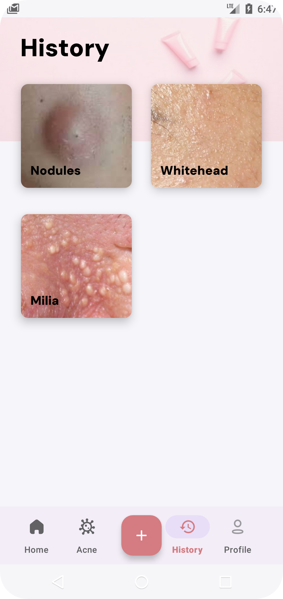
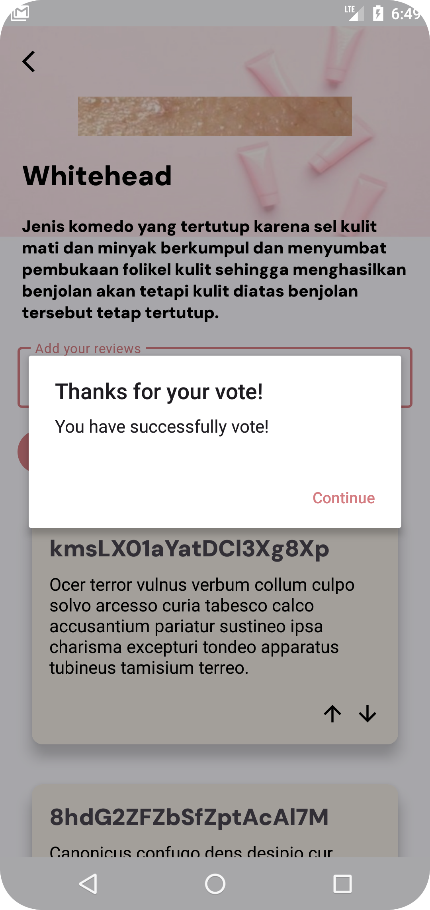

# Acnetify App

A mobile application to identify acne types and recommend acne treatment product ingredients to help 
users. The app is created by identifying the type of acne that corresponds to the data we have 
trained with our model through the user's smartphone camera or uploaded photos.

| Project Name                 | Acnetify                       |
|------------------------------|--------------------------------|
| Minimum Target SDK           | Phone and Tablet, API level 24 |
| Activity Type                | Empty Views Activity           |
| Language                     | Kotlin                         |
| Build Configuration Language | Kotlin DSL                     |

| Features       |
|----------------|
| Authentication |
| Feeds          |
| Profile        |
| Acne Types     |
| Acne History   |
| Acne Detail    |
| Acne Upload    |

## 👀 Previews

This the output application after running the project:

    
    
    
    
    
    
    
    
    
    
    

## 📋 Prerequisites

- [Android Studio](https://developer.android.com/studio)
- [Java Development Kit (JDK) 17](https://www.oracle.com/java/technologies/javase/jdk17-archive-downloads.html)

## 🧪 Installation

Clone the Repository:

    https://github.com/Acnetify/AcnetifyApp.git

Open the Project in Android Studio:

    Open Android Studio
    Click on File -> Open... and select the cloned project directory

Install Dependencies:

    Android Studio will automatically sync the project and download necessary dependencies. If not, go to File -> Sync Project with Gradle Files.

## ▶️ Running the Project

Build the Project:

    Click on Build -> Rebuild Project in Android Studio.
    Run the Project

Connect an Android device or start an emulator:
    
    Click on the Run button or go to Run -> Run 'app'.

